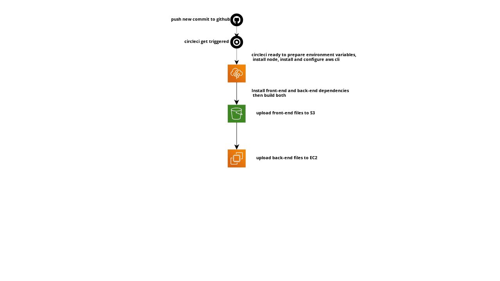

# Pipline

- circleci pipeline is triggered when a new commit is pushed to "main" branch

### 1.Install required software

- node: circleci/node@5.0.0
- aws-cli: circleci/aws-cli@2.0.6
- eb: circleci/aws-elastic-beanstalk@2.0.1

### 2.Build the project

- Install dependencies of front-end
- Install dependencies of back-end
- Build front-end
- Build back-end
- deploy front-end (upload front-end files to S3 Bucket)
- deploy back-end (upload back-end files to Elastic Beanstalk)

# Infrastructure

## RDS

Relational Database Service (Postgres)

## EC2

Elastic Beanstalk to run the back-end and communicate with database and front-end

## S3

Bucket hosts static website (front-end files) and provide endpoint to be accessed

# Links

- website link: [http://hafez-udagram.s3-website-us-east-1.amazonaws.com/]: http://hafez-udagram.s3-website-us-east-1.amazonaws.com/
